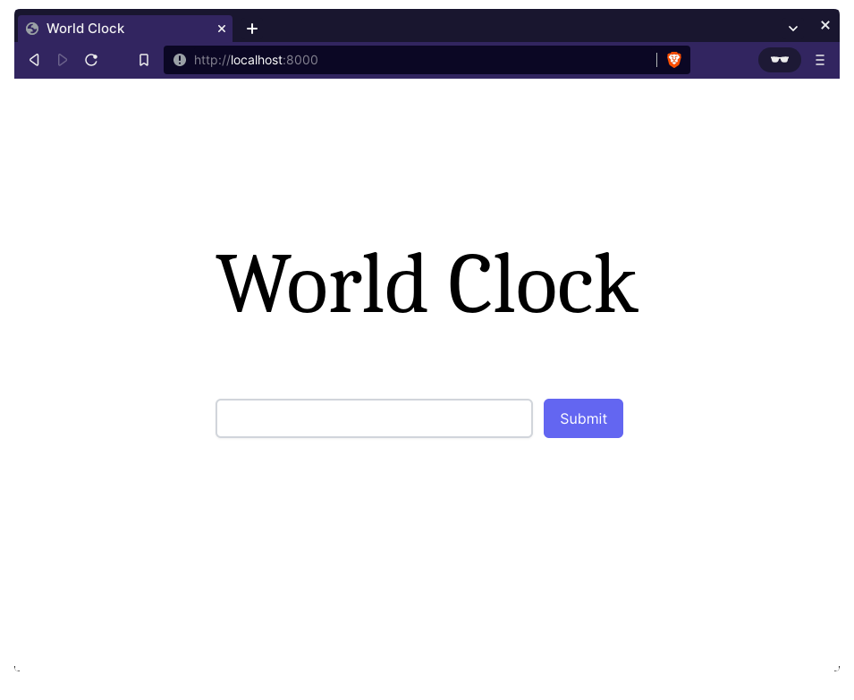

# Django World Clock

A world clock application built to demonstrate logging with [Loguru](https://github.com/Delgan/loguru).

**Tutorial**: [How to Start Logging with Loguru](#).



## 🟢 Prerequisites

You must have the latest version of [Python 3](https://www.python.org) installed on your machine. This project is tested against Python 3.10.0.

## 📦 Getting started

- Clone this repo to your machine:

  ```bash
  git clone https://github.com/betterstack-community/django-world-clock.git
  ```

- `cd` into the project directory:

  ```bash
  cd django-world-clock
  ```

- Install Python virtual environment:

  ```bash
  python3 -m venv env
  ```

- Activate the virtual environment.

  On Windows, run:

  ```bash
  env\Scripts\activate
  ```

  On Unix or macOS, run:

  ```bash
  source env/bin/activate
  ```

- `cd` into the `djangoWorldClock` app directory:

  ```bash
  cd djangoWorldClock
  ```

- Install the requirements:

  ```bash
  python -m pip install -r requirements.txt
  ```

- Run database migrations:

  ```bash
  python manage.py migrate
  ```

- Start the dev server:

  ```bash
  python manage.py runserver
  ```

You should see the following output if the dev server is started successfully:

```text
Watching for file changes with StatReloader
Performing system checks...

System check identified no issues (0 silenced).
September 18, 2022 - 18:21:58
Django version 4.1.1, using settings 'djangoWorldClock.settings'
Starting development server at http://127.0.0.1:8000/
Quit the server with CONTROL-C.
```

Open your browser and go to [http://127.0.0.1:8000/](http://127.0.0.1:8000/)

## ⚖ License

The code used in this project and in the linked tutorial are licensed under the [Apache License, Version 2.0](LICENSE).
